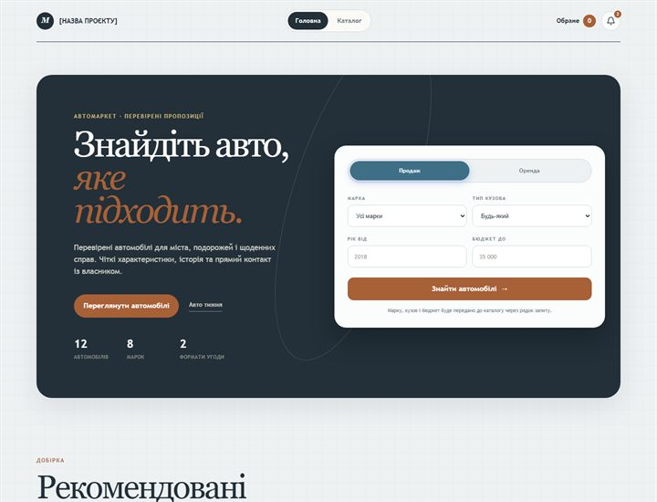
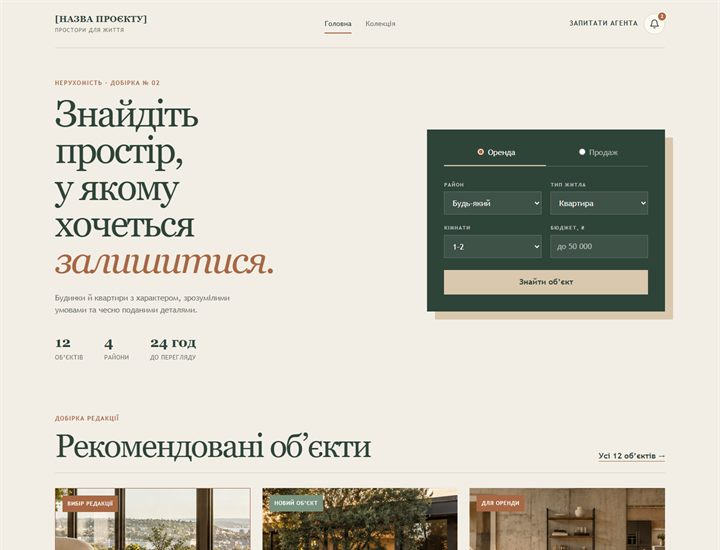
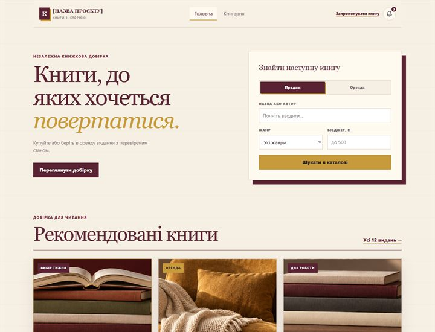
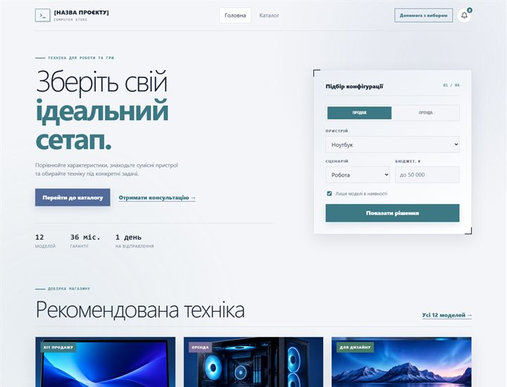

# Стартери лабораторної роботи №2

Комплект містить чотири статичні HTML/CSS-теми з однаковим набором сторінок
і порівнюваною складністю.

- `market-grid` демонструє каталог автомобілів у графітово-бронзовій палітрі;
- `property-editorial` демонструє нерухомість у палітрі каменю, шавлії та міді;
- `service-list` демонструє каталог книг у кремово-бордовій палітрі;
- `tech-showcase` демонструє комп’ютерну техніку в м’якій сіро-синій палітрі.

## Попередній перегляд

| `market-grid` — автомобілі                                                   | `property-editorial` — нерухомість                                                                |
| ---------------------------------------------------------------------------- | ------------------------------------------------------------------------------------------------- |
| [](market-grid/) | [](property-editorial/) |
| `service-list` — книги                                                       | `tech-showcase` — комп’ютерна техніка                                                             |
| [](service-list/)     | [](tech-showcase/)       |

Кожна тема містить `index.html`, `catalog.html`, `show.html`, `404.html`,
`styles.css`, `partners.js` і локальні зображення без зовнішніх мережевих
ресурсів. Невеликий сценарій `partners.js` реалізує ручне гортання логотипів
партнерів. Таблиці стилів поділено парними коментарями-маркерами початку й
кінця основних груп BEM-блоків. Відкрийте `index.html` безпосередньо в браузері
або запустіть локальний статичний сервер.

```bash
cd starter/market-grid
php -S 127.0.0.1:8080
```

Замініть плейсхолдери даними студента, адаптуйте тексти до отриманого варіанта,
а потім перенесіть обрану тему до Laravel. Готових Blade-шаблонів комплект не
містить.

## Спільний інтерфейс для майбутньої логіки

Усі теми використовують однакові data-атрибути для елементів, які пізніше
взаємодіятимуть із backend.

- кнопка заявки має data-action="request", data-endpoint="/api/requests" і
  data-item зі slug позиції;
- випадне меню сповіщень у шапці має data-component="notification-center" і
  data-endpoint="/api/notifications";
- список нових подій позначений data-notification-list та aria-live;
- кожна подія має data-notification-id і data-event;
- дії зі сповіщеннями використовують data-action="mark-read" та
  data-action="mark-all-read".

Цей контракт не виконує мережевих запитів у статичному стартері. Під час
перенесення до Blade компонент доцільно розмістити у спільному layout, а
обробку подій під’єднати в наступних лабораторних роботах.

Файл `catalog.php` копіюється до `config/catalog.php`. Він задає десять
предметних профілів і seed, але не реалізує `CatalogService`.

Перевірку структури всіх тем можна запустити з каталогу `starter`.

```bash
node check.mjs
```
